# Prisma Schema Data Model Overview (As of 2025-05-10)

This document summarizes the core data architecture of the Nestup Web App as defined in `backend/prisma/schema.prisma`.

## Core Entities Overview

*   **`User`**: Central entity for all system users, encompassing both internal employees and external clients. It manages identity (email, password, phone number), profile information, verification status, active status, and role assignments. It serves as the anchor for numerous relationships, linking users to projects they've created, updated, or are assigned to (as engineers or clients), tasks they've updated, files they've uploaded, teams they belong to or manage, comments, and actions.
*   **`Team`**: Represents internal employee teams, each with a designated manager (a `User`) and multiple members (`User` entities). This model facilitates organizing internal users for project assignments and collaboration.
*   **`Project`**: Represents a construction or design project. It tracks essential details like name, description, address, location, sqft, status (linked to `Status` model), assigned client and engineer, creation/update metadata, estimated/actual timelines, and a count of "vbCount" (purpose to be clarified). It's a central hub linking to tasks, comments, user actions, materials, and instances of catalogue items. A key feature is the `generatedPlankListFileId`, linking to a `File` entry for generated plank lists.
*   **`Task` & `Subtask`**: Implement hierarchical task management within projects. `Task` includes fields for stage, status, uploader/viewer roles, action required, and `metadataJson` for flexible data. `Subtask` further breaks down tasks, including its own `actionRequired`, `type`, and `metadataJson`, and supports cascading deletion if the parent task is deleted.
*   **`File`**: Manages file uploads, linking them to a specific `Task` and the `User` who uploaded them. It also has a special relation `projectsAsPlankList` to link back to `Project` entities where this file serves as the generated plank list.
*   **`Material`**: Defines project-specific materials with properties like ply thickness, laminate codes, overall thickness, ply type, and edge banding codes. Each material is unique within a project.
*   **`SiteVisitBox`**: Configures "site visit boxes" linked to tasks, storing model type and `inputs` (as JSON) for specific dimensions, adjacencies, etc.
*   **RBAC Models (`UserRole`, `UserPermission`, `RolePermissionMapping`):** Define a role-based access control system. `UserRole` specifies roles (e.g., Admin, Engineer) and their type. `UserPermission` lists available permissions. `RolePermissionMapping` links roles to permissions.
*   **`CatalogueItemDefinition`**: A blueprint for reusable and configurable items (e.g., types of furniture, components). It defines a name, description, input parameters (`CatalogueItemInputParameter`), and a Bill of Materials (`CatalogueItemBomItem`). Includes fields for sample inputs and expected output schema for testing logic scripts.
*   **`CatalogueItemInputParameter`**: Defines the configurable inputs for a `CatalogueItemDefinition`, including name, display label, input type (NUMBER, TEXT, etc.), default value, options (for SELECT), unit, and description.
*   **`CatalogueItemBomItem`**: Represents an item within the Bill of Materials of a `CatalogueItemDefinition`. It includes the item's name, type (PLANK, HARDWARE, ADDON), and crucially, an `itemLogicScript` (JavaScript string) to dynamically calculate its properties.
*   **`ProjectCatalogueItemInstance`**: A specific instance of a `CatalogueItemDefinition` used within a particular `Project`. It stores the user-provided `runtimeInputsJson` that configure the instance based on the defined input parameters. This instance is then used to generate outputs like plank lists.
*   **`GeneratedPlankList`**: Stores the output (e.g., a CSV file path or content) generated from a `ProjectCatalogueItemInstance` using its associated `itemLogicScript` and `runtimeInputsJson`.

## Key Relationships (Mermaid ERD)

```mermaid
erDiagram
    User ||--o{ Team : "manages (1)"
    User ||--o{ Team : "member of (0..n)"
    User ||--o{ Project : "created (0..n)"
    User ||--o{ Project : "updated (0..n)"
    User ||--o{ Project : "engineer for (0..n)"
    User ||--o{ Task : "updated (0..n)"
    User ||--o{ File : "uploaded (0..n)"
    User ||--o{ Comment : "created (0..n)"
    User ||--o{ UserAction : "performed (0..n)"
    User }o--|| UserRole : "has role"

    Team ||--o{ EngineerTeamMapping : "has"
    User ||--o{ EngineerTeamMapping : "is engineer in"

    Project ||--|{ Task : "contains"
    Project ||--o{ ClientProjectMapping : "has client mapping"
    User ||--o{ ClientProjectMapping : "is client for"
    Project ||--o{ EngineerProjectMapping : "has engineer history"
    Project ||--o{ Material : "uses"
    Project ||--o{ Comment : "has"
    Project ||--o{ UserAction : "related to"
    Project ||--o{ ProjectCatalogueItemInstance : "instances"
    Project }o--o| File : "generatedPlankListFile (optional)"
    Project }o--o| Status : "has status"

    Task ||--|{ Subtask : "contains"
    Task ||--o{ File : "has"
    Task ||--o{ Comment : "has"
    Task ||--o{ UserAction : "related to"
    Task ||--o{ SiteVisitBox : "has"
    Task }o--|| Status : "has status"

    UserRole ||--o{ RolePermissionMapping : "has permission mapping"
    UserPermission ||--o{ RolePermissionMapping : "is permission for"

    CatalogueItemDefinition ||--|{ CatalogueItemInputParameter : "defines"
    CatalogueItemDefinition ||--|{ CatalogueItemBomItem : "defines BOM for"
    CatalogueItemDefinition ||--o{ ProjectCatalogueItemInstance : "is template for"

    ProjectCatalogueItemInstance ||--o{ GeneratedPlankList : "generates"

```

## Catalogue System Deep Dive

The Catalogue System is a sophisticated feature designed for defining reusable, configurable, and dynamically calculated project components.
1.  **Definition (`CatalogueItemDefinition`):** A user defines a "template" for an item (e.g., "Standard Kitchen Cabinet"). This definition includes:
    *   **Input Parameters (`CatalogueItemInputParameter`):** These are the variables the end-user will configure (e.g., `width`, `height`, `materialChoice`, `numberOfShelves`). Each parameter has a type, potential default value, and UI hints.
    *   **Bill of Materials (`CatalogueItemBomItem`):** This lists all the sub-components (planks, hardware) needed to make the defined item.
2.  **Dynamic Logic (`CatalogueItemBomItem.itemLogicScript`):** Each BOM item (especially planks) has an associated JavaScript string. This script takes the user-provided runtime inputs (see below) and calculates the final properties of that BOM item (e.g., dimensions, material codes, edge banding, machining details for a plank).
3.  **Instantiation in a Project (`ProjectCatalogueItemInstance`):** When a user adds a catalogue item to a specific project, they create an "instance." For this instance, they provide concrete values for the input parameters defined in `CatalogueItemDefinition`. These values are stored in `runtimeInputsJson`.
4.  **Output Generation (`GeneratedPlankList`):** The system can then take a `ProjectCatalogueItemInstance`, execute the `itemLogicScript` for each of its BOM items using the provided `runtimeInputsJson`, and generate a list of fully specified components (e.g., a plank list for manufacturing).

This system allows for complex product definitions where the final parts are derived from a set of rules and user inputs, rather than being statically defined.

## Noteworthy Conventions & Patterns

*   **JSON for Extensibility:** Fields like `Task.metadataJson`, `Subtask.metadataJson`, `SiteVisitBox.inputs`, `ProjectCatalogueItemInstance.runtimeInputsJson`, and `CatalogueItemInputParameter.options` utilize the `Json` data type. This provides flexibility to store varied structured data without frequent schema changes, adapting to diverse needs.
*   **Unique Constraints:** Enforced in several places to maintain data integrity, e.g., `User.email`, `User.phoneNumber`, `Team.managerId`, `Material.materialId` (scoped to `projectId`), `CatalogueItemDefinition.name`, `CatalogueItemInputParameter.inputName` (scoped to `modelDefinitionId`), `CatalogueItemBomItem.itemName` (scoped to `modelDefinitionId`).
*   **Implicit Soft Deletes:** The `User.isActive` field suggests a soft-delete pattern for users, allowing them to be deactivated rather than permanently removed, preserving historical data and relationships.
*   **Timestamping:** Consistent use of `createdAt` and `updatedAt` for record auditing.
*   **ID Generation:** Mix of auto-incrementing integers for most entities and CUIDs (`@default(cuid())`) for the Catalogue system entities, likely to ensure global uniqueness for catalogue definitions that might be shared or exported.

## Key Takeaways for Developers

1.  **Centrality of User and Project:** Most data revolves around users performing actions within the context of specific projects. Understanding these two models and their direct relations is crucial.
2.  **The Catalogue System is Core:** A significant portion of the application's unique value proposition likely lies in the dynamic and scriptable Catalogue System. Developers working on product definition or manufacturing outputs will need to deeply understand `CatalogueItemDefinition` and its related models.
3.  **RBAC is Built-in:** The schema includes a standard RBAC structure (`UserRole`, `UserPermission`, `RolePermissionMapping`), indicating that authorization logic will be a key consideration throughout the application.
4.  **Flexibility through JSON:** Be prepared to work with and validate JSON-structured data in various parts of the application, particularly for task metadata and catalogue item configurations.
